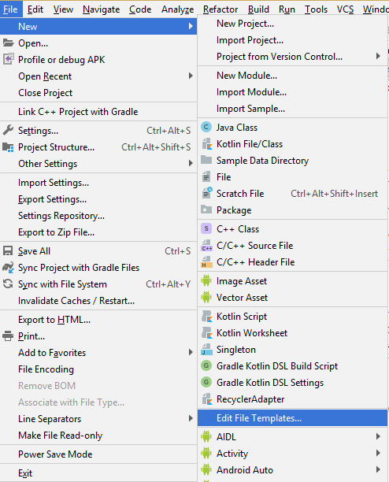
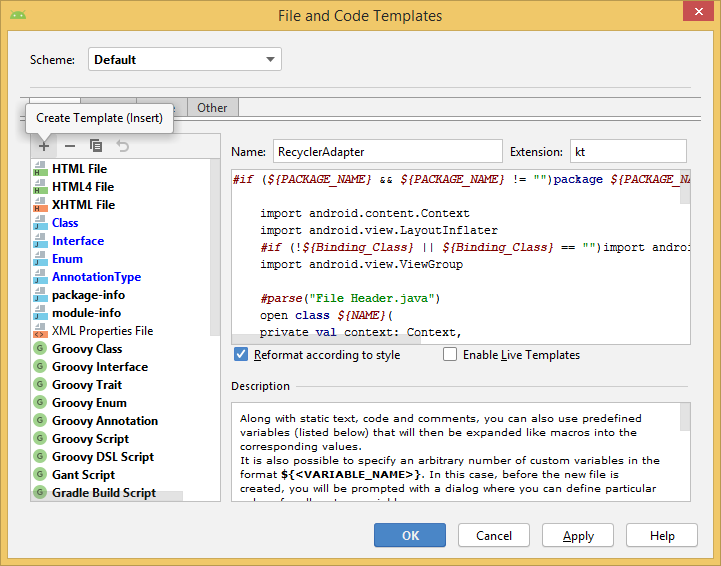
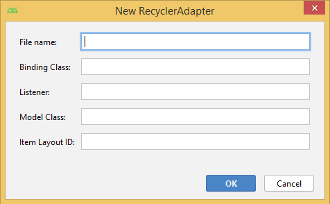

# RecyclerAdapterTemplate
Simple RecyclerView template for creating RecyclerAdapter using kotlin

To create new template.

- File -> New -> Edit File Templates...

 
 
- Click on + icon give name for templates and specify the extension.

 
 
- Copy paste the above code and click on apply then OK.
- Now you are ready to use template.
- Again click on File tab -> New you will find the template with name specified.
- For more how to create a template visit https://riggaroo.co.za/custom-file-templates-android-studio/

 

- Here **File Name** , **Model Class** and **Item Layout ID** are mandatory fields.
- **File Name** will provide name for our adapter class.
- **Model Class** it's our data class or wrapper which specify the type of data we want set to adapter.
- **Item Layout** it is our layout which we are going to inflate for recyclerview.
- **Binding Class** and **Listener** are optional fields.
- **Binding Class** can be provided based on data binding layout.
- And **Listener** can be pass when you need `onClick()` in recycler view. You can provide click event interface here.
- Base on your requirement you can provide filed for the adapter.
